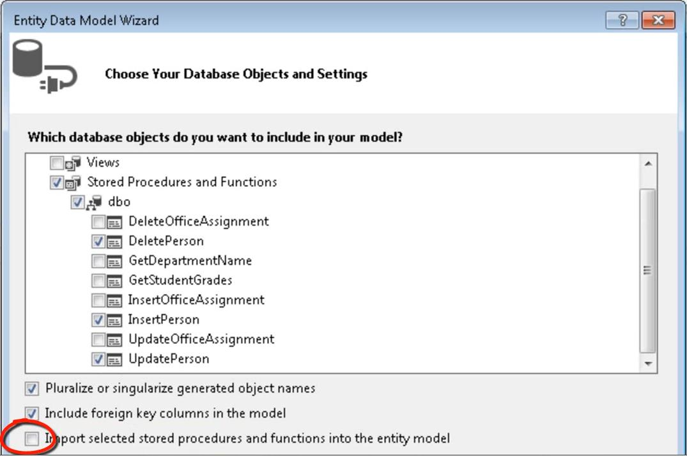
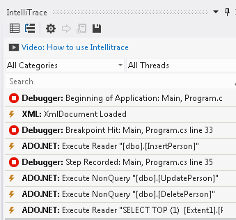

# Entity Framework Designer CUD Sprocs
This step-by-step walkthrough show how to map the create\\insert, update, and delete (CUD) operations of an entity type to stored procedures using the Entity Framework Designer (EF Designer).  By default, the Entity Framework automatically generates the SQL statements for the CUD operations, but you can also map stored procedures to these operations.  

Note, that Code First does not support mapping to stored procedures or functions. However, you can call stored procedures or functions by using the System.Data.Entity.DbSet.SqlQuery method. For example: `context.Products.SqlQuery("EXECUTE [dbo].[GetAllProducts]")`.

 

## Considerations when Mapping the CUD Operations to Stored Procedures

When mapping the CUD operations to stored procedures, the following considerations apply: 

-   If you are mapping one of the CUD operations to a stored procedure, map all of them. If you do not map all three, the unmapped operations will fail if executed and an **UpdateException** will be thrown.
-   You must map every parameter of the stored procedure to entity properties.
-   If the server generates the primary key value for the inserted row, you must map this value back to the entity's key property. In the example that follows, the **InsertPerson** stored procedure returns the newly created primary key as part of the stored procedure's result set. The primary key is mapped to the entity key (**PersonID**) using the **&lt;Add Result Bindings&gt;** feature of the EF Designer.
-   The stored procedure calls are mapped 1:1 with the entities in the conceptual model. For example, if you implement an inheritance hierarchy in your conceptual model and then map the CUD stored procedures for the **Parent** (base) and the **Child** (derived) entities, saving the **Child** changes will only call the **Child**’s stored procedures, it will not trigger the **Parent**’s stored procedures calls.

 

## Prerequisites

Visual Studio 2012, Ultimate, Premium, Professional, or Web Express edition.

To complete this walkthrough, you must install the [School database](../ef6/entity-framework-school-database.md).

 

## Set up the Project

-   Open Visual Studio 2012.
-   Select **File-&gt; New -&gt; Project**
-   In the left pane, click **Visual C\#**, and then select the **Console** template.
-   Enter **CUDSProcsSample** as the name.
-   Select **OK**.

 

## Create a Model

-   Right-click the project name in Solution Explorer, and select **Add -&gt; New Item**.
-   Select **Data** from the left menu and then select **ADO.NET Entity Data Model** in the Templates pane.
-   Enter **CUDSProcs.edmx** for the file name, and then click **Add**.
-   In the Choose Model Contents dialog box, select **Generate from database**, and then click **Next**.
-   Click **New Connection**. In the Connection Properties dialog box, enter the server name (for example, **(localdb)\\v11.0**), select the authentication method, type **School** for the database name, and then click **OK**.
    The Choose Your Data Connection dialog box is updated with your database connection setting.
-   In the Choose Your Database Objects dialog box, under the **Tables** node, select the **Person** table.
-   Also, select the following stored procedures under the **Stored Procedures and Functions** node: **DeletePerson**, **InsertPerson**, and **UpdatePerson**. 
-   Starting with Visual Studio 2012 the EF Designer supports bulk import of stored procedures. The **Import selected stored procedures and functions into the entity model** is checked by default. Since in this example we have stored procedures that insert, update, and delete entity types, we do not want to import them and will uncheck this checkbox. 
    
    
    
-   Click **Finish**.
    The EF Designer, which provides a design surface for editing your model, is displayed.

 

## Map the Person Entity to Stored Procedures

-   Right-click the **Person** entity type and select **Stored Procedure Mapping**.
-   The stored procedure mappings appear in the **Mapping Details** window.
-   Click **&lt;Select Insert Function&gt;**.
    The field becomes a drop-down list of the stored procedures in the storage model that can be mapped to entity types in the conceptual model.
    Select **InsertPerson** from the drop-down list.
-   Default mappings between stored procedure parameters and entity properties appear. Note that arrows indicate the mapping direction: Property values are supplied to stored procedure parameters.
-   Click **&lt;Add Result Binding&gt;**.
-   Type **NewPersonID**, the name of the parameter returned by the **InsertPerson** stored procedure. Make sure not to type leading or trailing spaces.
-   Press **Enter**.
-   By default, **NewPersonID** is mapped to the entity key **PersonID**. Note that an arrow indicates the direction of the mapping: The value of the result column is supplied to the property.
    
    
    
-   Click **&lt;Select Update Function&gt;** and select **UpdatePerson** from the resulting drop-down list.
-   Default mappings between stored procedure parameters and entity properties appear.
-   Click **&lt;Select Delete Function&gt;** and select **DeletePerson** from the resulting drop-down list.
-   Default mappings between stored procedure parameters and entity properties appear.

 

The insert, update, and delete operations of the **Person** entity type are now mapped to stored procedures.

If you want to enable concurrency checking when updating or deleting an entity with stored procedures, use one of the following options:

-   Use an **OUTPUT** parameter to return the number of affected rows from the stored procedure and check the **Rows Affected Parameter** checkbox next to the parameter name. If the value returned is zero when the operation is called, an  [**OptimisticConcurrencyException**](https://msdn.microsoft.com/library/system.data.optimisticconcurrencyexception.aspx) will be thrown.
-   Check the **Use Original Value** checkbox next to a property that you want to use for concurrency checking. When an update is attempted, the value of the property that was originally read from the database will be used when writing data back to the database. If the value does not match the value in the database, an **OptimisticConcurrencyException** will be thrown.

 

## Use the Model

Open the **Program.cs** file where the **Main** method is defined. Add the following code into the Main function.

The code creates a new **Person** object, then updates the object, and finally deletes the object.         

```
    using (var context = new SchoolEntities())
    {
        var newInstructor = new Person
        {
            FirstName = "Robyn",
            LastName = "Martin",
            HireDate = DateTime.Now,
            Discriminator = "Instructor"
        }

        // Add the new object to the context.
        context.People.Add(newInstructor);

        Console.WriteLine("Added {0} {1} to the context.",
            newInstructor.FirstName, newInstructor.LastName);

        Console.WriteLine("Before SaveChanges, the PersonID is: {0}",
            newInstructor.PersonID);

        // SaveChanges will call the InsertPerson sproc.  
        // The PersonID property will be assigned the value 
        // returned by the sproc. 
        context.SaveChanges();

        Console.WriteLine("After SaveChanges, the PersonID is: {0}",
            newInstructor.PersonID);
                    
        // Modify the object and call SaveChanges.
        // This time, the UpdatePerson will be called.
        newInstructor.FirstName = "Rachel";
        context.SaveChanges();

        // Remove the object from the context and call SaveChanges.
        // The DeletePerson sproc will be called.
        context.People.Remove(newInstructor);
        context.SaveChanges();

        Person deletedInstructor = context.People.
            Where(p => p.PersonID == newInstructor.PersonID).
            FirstOrDefault();

        if (deletedInstructor == null)
            Console.WriteLine("A person with PersonID {0} was deleted.", 
                newInstructor.PersonID);
    }
```

 

-   Compile and run the application. The program produces the following output *
    > **Note:** PersonID is auto-generated by the server, so you will most likely see a different number*

```
Added Robyn Martin to the context.
Before SaveChanges, the PersonID is: 0
After SaveChanges, the PersonID is: 51
A person with PersonID 51 was deleted.
```

 

If you are working with the Ultimate version of Visual Studio, you can use Intellitrace with the debugger to see the SQL statements that get executed.


